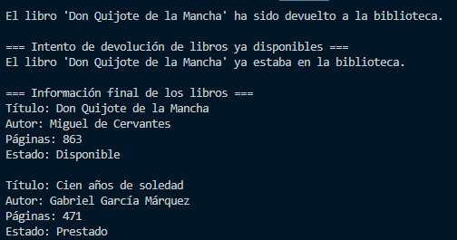

# Taller: Clases y Objetos en Python

# Descripción
Este taller consiste en implementar una clase **Libro** que permita gestionar información básica de una biblioteca, incluyendo el préstamo y devolución de libros.

# Clase `Libro`

# Atributos
- `titulo (str)`: título del libro.
- `autor (str)`: autor del libro.
- `paginas (int)`: número total de páginas.
- `disponible (bool)`: indica si el libro está disponible (inicialmente `True`).

# Métodos
- `__init__(self, titulo, autor, paginas)`: constructor que inicializa los atributos.
- `prestar(self)`: cambia el estado a **no disponible** si el libro está libre, en caso contrario indica que ya está prestado.
- `devolver(self)`: cambia el estado a **disponible** si el libro estaba prestado, en caso contrario indica que ya estaba en la biblioteca.
- `informacion(self)`: devuelve una cadena con la información del libro, incluyendo su estado.

# Ejemplo de uso
```python
libro1 = Libro("Don Quijote de la Mancha", "Miguel de Cervantes", 863)
libro2 = Libro("Cien años de soledad", "Gabriel García Márquez", 471)

print(libro1.informacion())
print(libro1.prestar())
print(libro1.informacion())
print(libro1.devolver())

