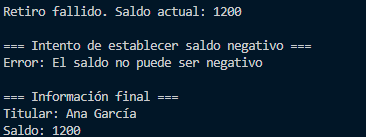

# Taller de Encapsulación en Python

# Descripción
Este taller implementa una clase **CuentaBancaria** que aplica el principio de **encapsulación** en Python mediante el uso de **atributos privados** y **propiedades**.

# Clase `CuentaBancaria`

# Atributos privados
- `_titular (str)`: nombre del titular de la cuenta.
- `_saldo (float)`: saldo de la cuenta bancaria (no puede ser negativo).

# Propiedades
- `titular`: propiedad de **solo lectura**, permite obtener el nombre del titular.
- `saldo`: propiedad de **lectura y escritura**, pero con validación para evitar saldos negativos.

# Métodos
- `depositar(cantidad)`: incrementa el saldo si la cantidad es positiva.  
  Devuelve `True` si la operación fue exitosa, `False` en caso contrario.
- `retirar(cantidad)`: disminuye el saldo si hay suficiente dinero.  
  Devuelve `True` si la operación fue exitosa, `False` en caso contrario.

# Constructor
```python
def __init__(self, titular, saldo=0.0)

