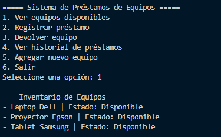

# Proyecto: Sistema de Préstamos de Equipos

## 📖 Descripción
Este proyecto implementa una aplicación en Python llamada **Sistema de Préstamos de Equipos**, diseñada para gestionar el inventario, los préstamos y las devoluciones de equipos en una institución.

El sistema utiliza **listas, tuplas y diccionarios** para organizar la información, junto con funciones modulares y un menú interactivo para la navegación.

---

## 📌 Funcionalidades principales

1. **Ver equipos disponibles**  
   Muestra el inventario de equipos y su estado actual (disponible o prestado).

2. **Registrar préstamo**  
   Permite asignar un equipo disponible a un usuario, registrando la información en una **tupla (usuario, fecha)** y guardándola en la lista de préstamos del equipo.

3. **Devolver equipo**  
   Marca un equipo como disponible nuevamente.

4. **Ver historial de préstamos**  
   Muestra todos los préstamos realizados para cada equipo.

5. **Agregar nuevo equipo**  
   Permite añadir equipos al sistema, inicializados como disponibles y con historial vacío.

6. **Salir**  
   Finaliza la ejecución del sistema.

---

## 📂 Estructura de datos
El inventario de equipos se gestiona con un **diccionario anidado**:

```python
equipos = {
    "Laptop Dell": {
        "disponible": True,
        "prestamos": [("Usuario1", "12/03/2025"), ("Usuario2", "14/03/2025")]
    },
    "Proyector Epson": {
        "disponible": False,
        "prestamos": []
    }
} 

# Ejemplo de ejecucion
